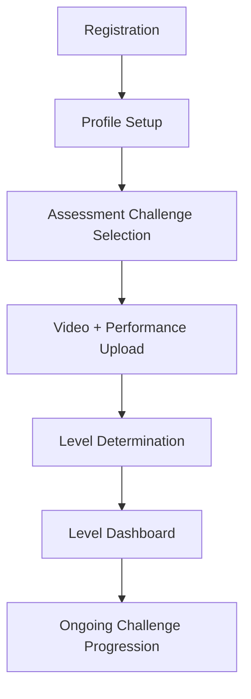

# 🎯 Implementation Design: Level Assessment Flow

## Overview
This document outlines the technical implementation approach for the new user onboarding and level assessment flow. The system will guide new players through a structured process to determine their starting level and create a clear progression path.

## 🎮 Complete User Flow



## 📱 Implementation Phases

### Phase 1: Enhanced Registration & Profile Setup (Week 1)

#### 1.1 Enhanced Registration Component
**File**: `src/components/auth/EnhancedRegistration.tsx`

```typescript
interface RegistrationStep {
  step: 'basic' | 'profile' | 'assessment' | 'level-assignment'
  data: Partial<UserData>
  isComplete: boolean
}

interface RegistrationFlow {
  currentStep: RegistrationStep['step']
  userData: Partial<UserData>
  assessmentChallenges: AssessmentChallenge[]
  completedChallenges: ChallengeSubmission[]
}
```

**Key Features:**
- Multi-step wizard UI with progress indicator
- Real-time validation at each step
- Ability to go back and modify previous steps
- Auto-save progress to localStorage

#### 1.2 Profile Setup Component
**File**: `src/components/onboarding/ProfileSetup.tsx`

**Data Collection:**
```typescript
interface ProfileSetupData {
  age: number // 6-40 range validation
  position: 'striker' | 'midfielder' | 'defender' | 'goalkeeper'
  dominantFoot: 'right' | 'left' | 'both'
  experienceYears: '0-1' | '2-5' | '6-10' | '10+'
  previousClub?: string
  height?: number // cm
  weight?: number // kg
}
```

**Validation Rules:**
- Age vs position validation (no goalkeepers under 10)
- Required fields enforcement
- Reasonable range validation for physical attributes

#### 1.3 Generic Assessment Challenge Selection
**File**: `src/lib/assessmentService.ts`

```typescript
class AssessmentService {
  static selectInitialAssessmentChallenges(): AssessmentChallenge[] {
    // Returns the same predefined list of generic challenges for ALL users
    // No player-specific filtering - standardized assessment for everyone
    return [
      GENERIC_CHALLENGES.BALL_CONTROL,
      GENERIC_CHALLENGES.SHORT_PASSING,
      GENERIC_CHALLENGES.SHOOTING_ACCURACY,
      GENERIC_CHALLENGES.BASIC_DRIBBLING,
      GENERIC_CHALLENGES.SPRINT_SPEED
    ]
  }
}
```

**Standardized Challenge Set:**
- **Ball Control**: Basic touch and control (same test for everyone)
- **Short Passing**: 20 passes to target accuracy
- **Shooting Accuracy**: 10 shots on target measurement
- **Basic Dribbling**: Cone weaving time and technique
- **Sprint Speed**: 30-meter sprint timing

**Benefits:**
- ✅ **Consistent baseline** - all players measured on same criteria
- ✅ **Easier calibration** - scores are directly comparable
- ✅ **Simpler implementation** - no complex selection algorithms
- ✅ **Faster onboarding** - standardized challenges are pre-tested

### Phase 2: Video Upload & Performance Data Collection (Week 2)

#### 2.1 Assessment Challenge Component
**File**: `src/components/onboarding/AssessmentChallenge.tsx`

```typescript
interface AssessmentChallengeProps {
  challenge: AssessmentChallenge
  onComplete: (submission: ChallengeSubmission) => void
  onSkip: () => void // Allow skipping optional challenges
}
```

**Features:**
- Challenge instruction display with demo video
- Video recording/upload interface
- Performance metrics input form
- Multiple attempt support (keep best submission)
- Progress tracking (challenge X of Y)

#### 2.2 Performance Metrics Collection
**File**: `src/components/onboarding/PerformanceMetrics.tsx`

**Example Metrics by Challenge Type:**

```typescript
interface PerformanceMetrics {
  // Shooting Accuracy Challenge
  shotsOnTarget?: number // out of 10
  shotsTotal?: number // always 10
  
  // Passing Accuracy Challenge  
  accuratePasses?: number // out of 20
  passesTotal?: number // always 20
  
  // Ball Control Challenge
  touchesToControl?: number // average touches per ball
  ballsControlled?: number // out of 10
  
  // Sprint Challenge
  sprintTime?: number // seconds for 30m
  
  // 1v1 Defending
  successfulDefends?: number // out of 5 attempts
}
```

#### 2.3 Video Upload with Progress
**Enhancement to existing**: `src/components/VideoUpload.tsx`

**New Features:**
- Assessment-specific validation (30-90 seconds)
- Multi-attempt support with comparison
- Compressed upload for faster processing
- Real-time upload progress with retry capability

### Phase 3: Level Determination Algorithm (Week 2-3)

#### 3.1 Simplified Scoring Algorithm
**File**: `src/lib/levelAssessmentService.ts`

```typescript
interface AssessmentScore {
  challengeId: string
  performanceScore: number // 1-10 based on metrics
  videoTechniqueScore: number // 1-10 from video analysis
  finalScore: number // simple average of performance + technique
}

class LevelAssessmentService {
  static calculateStartingLevel(
    assessmentScores: AssessmentScore[]
  ): number {
    // Simplified algorithm - no age/position weighting
    // Simply averages all challenge scores to determine level 1-10
    const averageScore = assessmentScores.reduce((sum, score) => sum + score.finalScore, 0) / assessmentScores.length
    return this.mapScoreToLevel(averageScore)
  }
  
  private static mapScoreToLevel(averageScore: number): number {
    // Direct mapping of average score to starting level
    if (averageScore >= 9.0) return 10
    if (averageScore >= 8.0) return 9
    if (averageScore >= 7.0) return 8
    if (averageScore >= 6.0) return 7
    if (averageScore >= 5.0) return 6
    if (averageScore >= 4.0) return 5
    if (averageScore >= 3.0) return 4
    if (averageScore >= 2.0) return 3
    if (averageScore >= 1.0) return 2
    return 1
  }
}
```

**Simplified Scoring:**
- ✅ **Performance Metrics**: Direct measurement scoring (1-10)
- ✅ **Video Technique**: Basic technique assessment (1-10)
- ✅ **Final Score**: Simple average - no complex weighting
- ✅ **Level Assignment**: Direct score-to-level mapping
- ❌ **No Age/Position Adjustment** - standardized for all players

#### 3.2 Level Assignment Logic

```typescript
const LEVEL_ASSIGNMENT_THRESHOLDS = {
  1: { minScore: 0, maxScore: 2.5, category: 'Complete Beginner' },
  2: { minScore: 2.5, maxScore: 3.5, category: 'Beginner' },
  3: { minScore: 3.5, maxScore: 4.5, category: 'Beginner+' },
  4: { minScore: 4.5, maxScore: 5.5, category: 'Developing' },
  5: { minScore: 5.5, maxScore: 6.5, category: 'Intermediate Beginner' },
  6: { minScore: 6.5, maxScore: 7.0, category: 'Intermediate' },
  7: { minScore: 7.0, maxScore: 7.5, category: 'Intermediate+' },
  8: { minScore: 7.5, maxScore: 8.5, category: 'Advanced Beginner' },
  9: { minScore: 8.5, maxScore: 9.5, category: 'Advanced' },
  10: { minScore: 9.5, maxScore: 10, category: 'Expert Beginner' }
}
```

### Phase 4: Level Dashboard & Progression (Week 3)

#### 4.1 Level Dashboard Component
**File**: `src/components/player/LevelDashboard.tsx`

```typescript
interface LevelDashboardProps {
  currentLevel: number
  progressToNextLevel: number // 0-100 percentage
  requiredChallenges: Challenge[] // challenges needed for next level
  completedChallenges: ChallengeSubmission[]
  skillAreas: SkillAssessment[] // strengths/weaknesses from assessment
}
```

**Dashboard Sections:**
1. **Current Level Display**: Visual level indicator with category
2. **Progress Bar**: X/Y challenges completed for next level
3. **Next Level Requirements**: Specific challenges with difficulty indicators
4. **Skill Assessment Summary**: Strengths and areas for improvement
5. **Estimated Timeline**: Typical time to complete current level
6. **Achievement Gallery**: Badges earned during assessment

#### 4.2 Enhanced Challenge Gating System with Performance Thresholds
**File**: `src/lib/challengeGatingService.ts`

```typescript
class ChallengeGatingService {
  static getRequiredChallengesForLevel(
    currentLevel: number
  ): Challenge[] {
    // Returns a LARGE set of challenges (e.g., 50) required for current level
    // No position filtering - all players get the same comprehensive challenge set
    return LEVEL_CHALLENGES[currentLevel] // Returns ~50 challenges per level
  }
  
  static checkLevelUpEligibility(
    currentLevel: number,
    completedChallenges: ChallengeSubmission[]
  ): boolean {
    // Enhanced check: Must complete ALL challenges AND meet score thresholds
    const requiredChallenges = this.getRequiredChallengesForLevel(currentLevel)
    
    for (const challenge of requiredChallenges) {
      const submission = completedChallenges.find(sub => sub.challengeId === challenge.id)
      
      // Check 1: Challenge must be completed
      if (!submission) return false
      
      // Check 2: Score must meet minimum threshold
      if (submission.totalScore < challenge.levelPassingScore) return false
    }
    
    return true // All challenges completed with passing scores
  }
  
  static getAvailableChallenges(
    playerLevel: number,
    completedChallenges: string[]
  ): Challenge[] {
    // Returns only current level challenges - no access to higher levels
    const levelChallenges = this.getRequiredChallengesForLevel(playerLevel)
    
    // Filter out already completed challenges for better UX
    return levelChallenges.filter(challenge => 
      !completedChallenges.includes(challenge.id)
    )
  }
}
```

**Key Features:**
- ✅ **Large Challenge Sets**: ~50 challenges per level for deep engagement
- ✅ **Performance Thresholds**: Must achieve minimum score, not just complete
- ✅ **Level Gating**: Can only access current level challenges
- ✅ **Comprehensive Progression**: Rich content keeps players engaged longer

## 🗃️ Database Schema Changes

### Enhanced User Model
```typescript
interface UserData {
  // ... existing fields
  
  // Assessment Results
  assessmentCompleted: boolean
  assessmentScores: AssessmentScore[]
  startingLevel: number
  levelAssignmentReason: string
  
  // Current Level Data
  currentLevel: number
  levelProgress: number // 0-100 percentage to next level
  completedLevelChallenges: string[] // challenge IDs completed for current level
  
  // Level History
  levelHistory: LevelProgression[] // track level advancement over time
}

interface LevelProgression {
  level: number
  achievedAt: Date
  challengesCompleted: string[]
  timeSpentInLevel: number // days
}
```

### Enhanced Challenge Model with Level Gating
```typescript
interface Challenge {
  id: string
  title: string
  description: string
  instructions: string[]
  demoVideoUrl?: string
  
  // Level System Integration
  requiredLevel: number // which level this challenge belongs to
  levelPassingScore: number // minimum score required to pass for level progression
  isAssessmentChallenge: boolean // true for initial 5 generic assessment challenges
  
  // Performance Metrics  
  metrics: ChallengeMetric[]
  scoringCriteria: ScoringCriteria
  
  // Progression Data
  difficultyRating: number // 1-10 difficulty within the level
  estimatedTimeMinutes: number // expected completion time
  prerequisiteChallenges?: string[] // other challenges that must be completed first
}

// Level Challenge Sets
interface LevelChallengeSet {
  level: number
  challenges: Challenge[] // ~50 challenges per level
  totalChallenges: number
  estimatedCompletionDays: number
  skillFocusAreas: string[] // main skills developed at this level
}
```

## 🎨 UI/UX Design Considerations

### Visual Design
- **Progress Indicators**: Clear step indicators throughout onboarding
- **Challenge Cards**: Visually appealing cards with difficulty indicators
- **Level Visualization**: RPG-style level display with progress bars
- **Video Interface**: Professional video upload/playback interface
- **Mobile-First**: Responsive design optimized for mobile recording

### User Experience
- **Save & Resume**: Ability to pause and resume assessment later
- **Clear Instructions**: Step-by-step guidance with visual aids
- **Encouragement**: Positive reinforcement throughout the process
- **Transparency**: Clear explanation of how level is determined
- **Multiple Attempts**: Reduce pressure by allowing challenge retakes

## 🔧 Technical Requirements

### Performance Considerations
- **Video Optimization**: Automatic compression for faster uploads
- **Progressive Enhancement**: Basic functionality works without JavaScript
- **Offline Support**: Cache challenge instructions for offline viewing
- **Error Handling**: Graceful degradation when services are unavailable

### Security & Validation
- **Input Validation**: Server-side validation of all performance metrics
- **Video Validation**: File type, duration, and content validation
- **Rate Limiting**: Prevent abuse of challenge submission system
- **Data Privacy**: Secure handling of assessment videos and data

### Analytics & Monitoring
- **Completion Rates**: Track where users drop off in onboarding
- **Level Distribution**: Monitor starting level assignments for balance
- **Performance Metrics**: Track typical completion times for optimization
- **User Feedback**: Collect feedback on assessment difficulty and clarity

## 🚀 Implementation Timeline

### Week 1: Foundation
- [ ] Enhanced registration flow components
- [ ] Profile setup wizard with validation
- [ ] Assessment challenge selection algorithm
- [ ] Database schema updates

### Week 2: Assessment System
- [ ] Challenge presentation components
- [ ] Video upload enhancement for assessments
- [ ] Performance metrics collection interfaces
- [ ] Level determination algorithm

### Week 3: Dashboard & Integration
- [ ] Level dashboard component
- [ ] Challenge gating system
- [ ] Assessment result display
- [ ] Integration with existing challenge system

### Week 4: Polish & Testing
- [ ] UI/UX refinements
- [ ] Comprehensive testing
- [ ] Performance optimization
- [ ] Analytics implementation

## 🎯 Success Metrics

### Technical Metrics
- **Completion Rate**: >85% of users complete full assessment
- **Upload Success**: >95% video upload success rate
- **Performance**: Assessment completes in <10 minutes
- **Accuracy**: Level assignments correlate with long-term performance

### User Experience Metrics
- **User Satisfaction**: >4.5/5 rating for onboarding experience
- **Clarity**: >90% understand their level assignment
- **Engagement**: >80% complete first level challenges within 1 week
- **Retention**: >70% active after 1 month

This implementation provides a structured, engaging, and technically sound approach to player assessment and level assignment that will significantly enhance the platform's value proposition.
